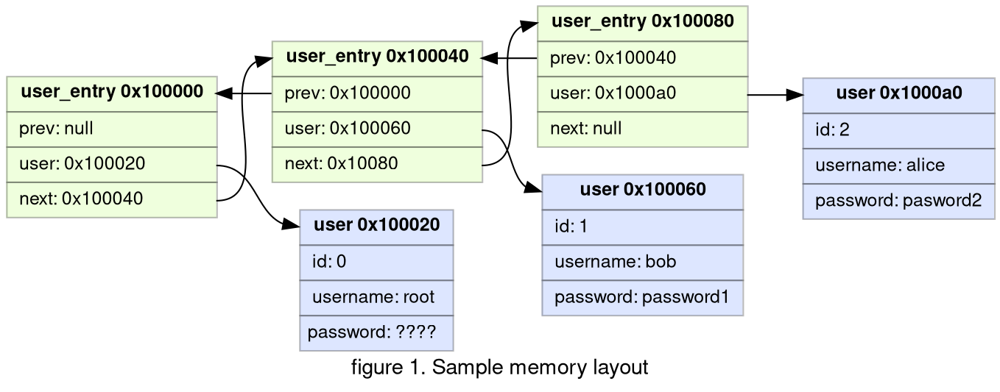
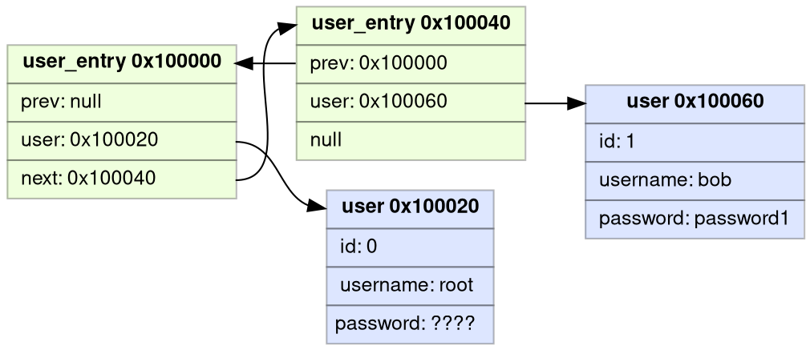
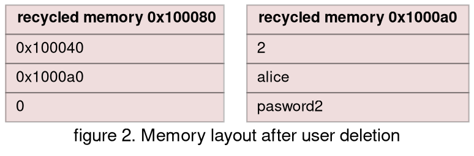
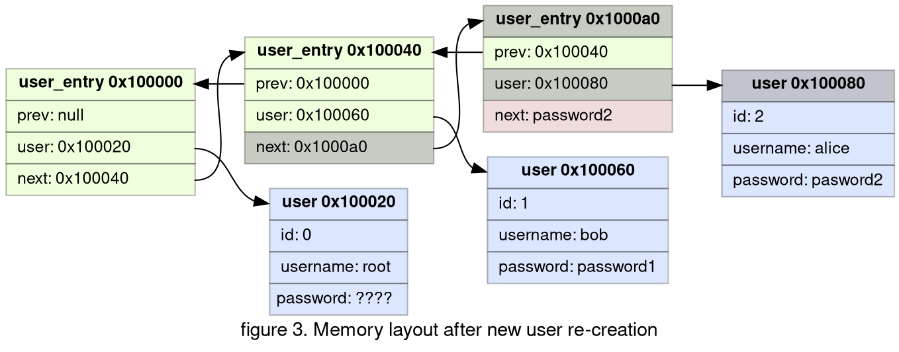

## Prologue

Difficulty: easy

Category: binary exploitation

Solved: 95

!!! quote "Description"
    Please sign in as root to get a shell.

Input files:

??? info "sign-in.c"
    ```c
    #include <stdio.h>
    #include <stdlib.h>
    #include <string.h>
    #include <unistd.h>
    #include <sys/random.h>
    
    typedef struct {
        long uid;
        char username[8];
        char password[8];
    } user_t;
    
    typedef struct user_entry user_entry_t;
    struct user_entry {
        user_t* user;
        user_entry_t* prev;
        user_entry_t* next;
    };
    
    user_entry_t user_list;
    long UID = 1;
    
    void init() {
        setvbuf(stdin, 0, 2, 0);
        setvbuf(stdout, 0, 2, 0);
    }
    
    int menu() {
        int choice;
        puts("1. Sign up");
        puts("2. Sign in");
        puts("3. Remove account");
        puts("4. Get shell");
        printf("> ");
        scanf("%d", &choice);
        return choice;
    }
    
    void sign_up() {
        user_t* user = malloc(sizeof(user_t));
        user_entry_t* entry = malloc(sizeof(user_entry_t));
        user->uid = UID++;
        printf("username: ");
        read(0, user->username, 8);
        printf("password: ");
        read(0, user->password, 8);
        entry->user = user;
    
        user_entry_t* curr = &user_list;
        while(curr->next) {
            curr = curr->next;
        }
        entry->prev = curr;
        curr->next = entry;
    }
    
    void remove_account(int uid) {
        user_entry_t* curr = &user_list;
        do {
            if(curr->user->uid == uid) {
                if(curr->prev) {
                    curr->prev->next = curr->next;
                }
                if(curr->next) {
                    curr->next->prev = curr->prev;
                }
                free(curr->user);
                free(curr);
                break;
            }
            curr = curr->next;
        } while(curr);
    }
    
    long sign_in() {
        char username[9] = {0};
        char password[9] = {0};
        printf("username: ");
        read(0, username, 8);
        printf("password: ");
        read(0, password, 8);
        user_entry_t* curr = &user_list;
        do {
            if(memcmp(curr->user->username, username, 8) == 0 && memcmp(curr->user->password, password, 8) == 0) {
                printf("Logging in as %s\n", username);
                return curr->user->uid;
            }
            curr = curr->next;
        } while(curr);
        return -1;
    }
    
    int main() {
        init();
    
        long uid = -1;
        user_t root = {
            .uid = 0,
            .username = "root",
        };
        if(getrandom(root.password, 8, 0) != 8) {
            exit(1);
        }
    
        user_list.next = NULL;
        user_list.prev = NULL;
        user_list.user = &root;
    
        while(1) {
            int choice = menu();
            if(choice == 1) {
                sign_up();
            } else if(choice == 2) {
                uid = sign_in();
                if(uid == -1) {
                    puts("Invalid username or password!");
                }
            } else if(choice == 3) {
                if(uid == -1) {
                    puts("Please sign in first!");
                } else {
                    remove_account(uid);
                    uid = -1;
                }
            } else if(choice == 4) {
                if(uid == 0) {
                    system("/bin/sh");
                } else {
                    puts("Please sign in as root first!");
                }
            } else {
                exit(1);
            }
        }
    }
    ```
    
* [sign-in binary](https://github.com/DownUnderCTF/Challenges_2024_Public/blob/f2797a33d8f5851508f37e854afceedf85eee8a3/pwn/sign-in/src/sign-in)

NB:


* Following indices bases system is used to avoid ambiguity. Whenever element of a collection is referenced by **number**, 0-based index implied. 
 
  Ie, element `0` of list `[1, 2, 4, 8, 16]` is `1`, Element `3` is `8`.
  
  When element is reference in explanation with **word** (first, third...), 1-based system is implied.

  Ie, first character of string `Hello World!` is `H`, fifth is `o`.

* Solution code was redacted for readability purposes. Due to time pressure during the competition I was using a lot of one-letter variables and questionable code structure.

* I am using gdb with [pwndbg](https://github.com/pwndbg/pwndbg) plugin

## My struggle

### Analysis

`user_entry` structure is a typical implementation of doubly linked list ([wiki](https://en.wikipedia.org/wiki/Doubly_linked_list)).

```c
struct user_entry {
    user_t* user;
    user_entry_t* prev;
    user_entry_t* next;
};
```

In memory it would look like like this:

* 3 user_entries with addresses 0x100000, 0x100040, 0x100080
* 3 user accounts with addresses 0x100020, 0x100060, 0x1000a0 (root, bob and alice)



New entries created during signup:

```c
void sign_up() {
    user_t* user = malloc(sizeof(user_t));
    user_entry_t* entry = malloc(sizeof(user_entry_t));  # we allocate memory for user_entry
    user->uid = UID++;
    printf("username: ");
    read(0, user->username, 8);
    printf("password: ");
    read(0, user->password, 8);
    entry->user = user;                                  # we set field 'user' of the entry

    user_entry_t* curr = &user_list;
    while(curr->next) {
        curr = curr->next;
    }
    entry->prev = curr;                                  # we set field 'prev' of the entry  
    curr->next = entry;
}
```

`sign_up` function sets values for `user` and `prev` fields, but it doesn't initialize value of `next` field. According to language specification,
value of the uninitialized variable is undeterminate. In practice, it will be the value that was in the RAM before allocation.
This value will be interpreted as address of the next entry in the list.

List traversal of the `sign_in` function will go to this "undeterminate" address and interpret that memory as `user_entry` structure.

```c
long sign_in() {
    char username[9] = {0};
    char password[9] = {0};
    printf("username: ");
    read(0, username, 8);
    printf("password: ");
    read(0, password, 8);
    user_entry_t* curr = &user_list;    # set curr variable to the head of the list 
    do {
                                        # read username and password from curr entry 
        if(memcmp(curr->user->username, username, 8) == 0 && memcmp(curr->user->password, password, 8) == 0) {
            printf("Logging in as %s\n", username);
            return curr->user->uid;
        }
        curr = curr->next;              # set curr variable to the next entry
    } while(curr);                      # use of uninitialized memory: check if its not null - continue iteration
    return -1;
}
```

So it `sing_in` will iterate over `next` values until it reaches null and treat memory at this `next` address as holder for
username and password.

When we delete user, memory would look like:


* 2 user_entries with addresses 0x100000, 0x100040
* 2 user accounts with addresses 0x100020, 0x100060 (root, bob)
* two recycled memory blocks that will be aviailable for view allocations: 0x100080, 0x1000a0




Now if we create a new user, recycled memory 0x100080 and 0x1000a0 will be reused for user account and user entry. Note that last
freed in `remove_account` item will be reused first by malloc in sign_up (effectively swaping addresses of user_entry and user account).
This change is highlighted compared to _figure 1_:



### Exploit

As you can see on figure3, password of deleted user is used as address of the next user entry. So our plan is:

1. Find memory address that can be interpreted as user account with user account data structured with id 0 and username and password that we know.
2. Create user account user1 using address from step 1 as a password.
3. Delete the account.
4. Create new account user2, this will trigger the exploit and create new entry with `next` set to address we selected in step 1.
5. Sign in with username and password that we got in step 1.

**Step 1**: we are looking for memory address for data structure:
```c
typedef struct {
    long uid;
    char username[8];
    char password[8];
}
```
We want uid to be 0, and username and password to be known. The best place to start in my opinion is binary code itself as
its static and we can scan it.


## Epilogue

* Official website: [https://downunderctf.com/](https://downunderctf.com/)
* Official writeups: https://github.com/DownUnderCTF/Challenges_2024_Public
