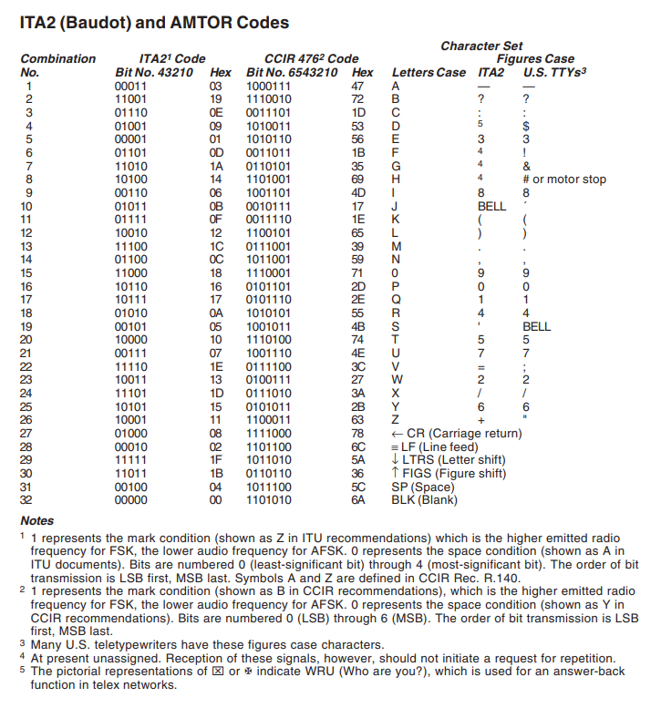

## Prologue

Difficulty: beginner

Category: miscellaneous

Solved: 299

!!! quote "Description"
    Those monsters! They've kidnapped the Quokkas! Who in their right mind would capture those friendly little guys.. We've managed to intercept a CCIR476 transmission from the kidnappers, we think it contains the location of our friends! Can you help us decode it? We managed to decode the first two characters as '##'

Input files:

??? info "encoding.txt"
    101101001101101101001110100110110101110100110100101101101010110101110010110100
    101110100111001101100101101101101000111100011110011011010101011001011101101010
    010111011100100011110101010110110101011010111001011010110100101101101010110101
    101011001011010011101110001101100101110101101010110011011100001101101101101010
    101101101000111010110110010111010110101100101100110111101000101011101110001101
    101101001010111001011101110001010111001011100011011

NB:


* Following indices bases system is used to avoid ambiguity. Whenever element of a collection is referenced by **number**, 0-based index implied. 
 
  Ie, element `0` of list `[1, 2, 4, 8, 16]` is `1`, Element `3` is `8`.
  
  When element is reference in explanation with **word** (first, third...), 1-based system is implied.

  Ie, first character of string `Hello World!` is `H`, fifth is `o`.

* Solution code was redacted for readability purposes. Due to time pressure during the competition I was using a lot of one-letter variables and questionable code structure.

## My struggle

Quick google CCIR476 leads us to wiki page that explains that CCIR476 is a character enconding used in radio data protocol.
So seems like we should start by decoding message. Article itself is not too friendly and doesn't explain much (too many
technical words without definition for my liking), but there is important bit it stats that CCIR 476 is a 7-bit encoding.
This allows us quickly test if our input is indeed CCID476 message without investing hours in the wrong direction:
length of input is 441 which is exactly 63 7bit words. Looks promising!

Second link in google is https://blog.gcwizard.net/manual/en/ccitt-codes/08-what-is-ccir-476/
Which contains table that can be used for decoding:


So in first version I created alphabet with all characters I can understand and left others (CR, LTRS, FIGS) empty:

!!! note "Interation 1"
    ```py
    letters={
        "1000111": "A",
        "1110010": "B",
        "0011101": "C",
        "1010011": 'D',
    
        "1010110": "E",
        "0011011": "F",
        "0110101": "G",
    
        "1101001": "H",
        "1001101": "I",
        "0010111": "J",
        "0011110": "K",
        "1100101": "L",
    
        "0111001": "M",
        "1011001": "N",
        "1110001": "O",
        "0101101": "P",
        "0101110": 'Q',
        "1010101": "R",
    
        "1001011": "S",
        "1110100": "T",
        "1001110": "U",
        "0111100": "V",
        "0100111": "W",
        "0111010": "X",
        "0101011": "Y",
        "1100011": "Z",
        "1011100": " ",
    
        "1111000": "",
        "0110110": "",
        "1011010": "",
    }
    input="101101001101101101001110100110110101110100110100101101101010110101110010110100101110100111001101100101101101101000111100011110011011010101011001011101101010010111011100100011110101010110110101011010111001011010110100101101101010110101101011001011010011101110001101100101110101101010110011011100001101101101101010101101101000111010110110010111010110101100101100110111101000101011101110001101101101001010111001011101110001010111001011100011011"
    
    for i in range(0, len(input), 7): # generate sequence 0, 7, 14 ... 441
        word = input[i:i+7] # take 7 characters starting at i
        print(letters[word], end="") # print letter from alphabet that corresponds to the sequence
    ```

The result is looking very promising, I can even read the sentence:
```txt
HHTHE QUPKKRSS ARE HELD QN FRCQLITY HQQOQQF
```
But some letters are wrong, and also according to description of the challenge result should start with `##`. So, how can we get
from `HH` to `##`? Notice from encoding table has many columns and `1101001` is `H` in letters case, but `#` in `US TTYs`
(whatever that means).

Probably ignored so far characters CR, LTRS and FIGS could be helpful. Explanation is very obvious, but on the day it took
quite a lot of trial and errors:

* LTRS - switches decoding into letters mode (ie after LTRS symbols all characters are letters until FIGS is encountered)
* FIGS - switching decoding into figures mode (ie all characters from now will be symbols until LTRS is encountered)

Second alphabet added, slightly updated decoding logic:

??? success "full solution"
    ```py
    letters={
        "1000111": "A",
        "1110010": "B",
        "0011101": "C",
        "1010011": 'D',
    
        "1010110": "E",
        "0011011": "F",
        "0110101": "G",
    
        "1101001": "H",
        "1001101": "I",
        "0010111": "J",
        "0011110": "K",
        "1100101": "L",
    
        "0111001": "M",
        "1011001": "N",
        "1110001": "O",
        "0101101": "P",
        "0101110": 'Q',
        "1010101": "R",
    
        "1001011": "S",
        "1110100": "T",
        "1001110": "U",
        "0111100": "V",
        "0100111": "W",
        "0111010": "X",
        "0101011": "Y",
        "1100011": "Z",
        "1011100": " ",
    
        "1111000": "",
        "0110110": "FIGS",
        "1011010": "LTRS",
    }
    
    figures={
        "1010011": '$',
        "1000111": "-",
        "1110001": "9",
        "1010110": "3",
        "1011100": " ",
        "0011101": ":",
        "0011011": "!",
        "0110101": "&",
        "1101001": "#",
        "1100101": ")",
        "1001101": "8",
        "0010111": "`",
        "0011110": "(",
        "0111001": ".",
        "1011001": ",",
        "0101101": "0",
        "0101110": '1',
        "1010101": "4",
        "1001011": "'",
        "1110100": "5",
        "1001110": "7",
        "0111100": ";",
        "0100111": "2",
        "0111010": "/",
        "0101011": "6",
        "1100011": "\"",
        "1111000": "",
        "0110110": "FIGS",
        "1011010": "LTRS",
    }
    
    mode=figures # variable to switch between letters and figures alphabets
    
    input="101101001101101101001110100110110101110100110100101101101010110101110010110100101110100111001101100101101101101000111100011110011011010101011001011101101010010111011100100011110101010110110101011010111001011010110100101101101010110101101011001011010011101110001101100101110101101010110011011100001101101101101010101101101000111010110110010111010110101100101100110111101000101011101110001101101101001010111001011101110001010111001011100011011"
    
    for w in range(0, len(input), 7):  # generate sequence 0, 7, 14 ... 441
        word = input[w:w+7] # take 7 characters starting at i
        if mode[word] == "FIGS":
            mode = figures
        elif mode[word] == "LTRS":
            mode = letters
        else:
            print(mode[input[w:w+7]], end="")  # print letter from alphabet that corresponds to the sequence
    
    ```

The only thing not mentioned before is I used `'` instead of `BELL` character because its not clear what that one means and 
single quote grammatically made sense. 

## Epilogue

* Official website: [https://downunderctf.com/](https://downunderctf.com/)
* Official writeups: https://github.com/DownUnderCTF/Challenges_2024_Public

*[LTRS]: Letter shift
*[FIGS]: Figure shift
*[CR]: Carriage return
